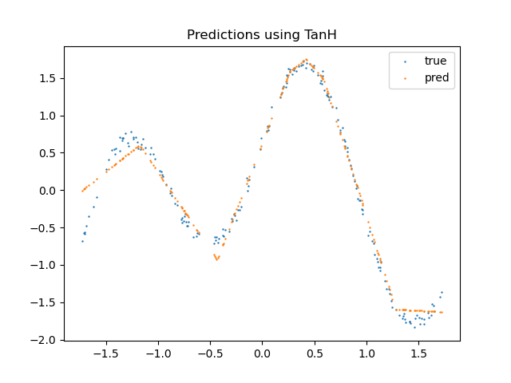

# simple-MLP
### Creating a simple MLP from scratch for learning purposes
Part of the code is based on a small assignment I had to do. Major changes I made were adding more functionalities and improving code structure (my original submission was one big notebook). Note that this is a work in progress, there is a lot more cool functionalities I want to add.
``````
├── activation_functions.py
├── generate_data.py
├── loss_functions.py
├── main.ipynb
├── MLP.py
├── train.py
└── utils.py
``````
### The MLP
Following *main.ipynb*, we start off with visualising some of the popular activation functions: ReLU, sigmoid and tanh. Because we need their derivatives for backpropagation, we also plot those.

As a loss function, we use the mean squared error (MSE). In the future, I want to add more loss functions.

Now, we are ready to explore *MLP.py*. Here, the MLP is initialized using random values from a normal distribution with mean 0 and standard deviation 1. In the future, we could explore different initialization methods. The MLP class has a forward pass and a backward pass. The forward pass is used to calculate the output of the network given an input. The backward pass is used to calculate the gradients of the weights and biases of the network.

In *train.py*, I implemented a simple gradient descent algorithm. In the future, I want to add more optimizers.

Next, I will show some visualizations of the results I got, they are pretty simple but they give an intuitive idea of some of the basics of neural networks.

## Activation functions and their derivatives


## MSE loss


## Predictions



